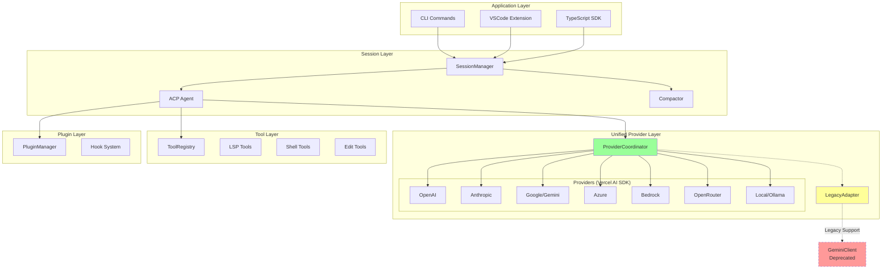

# Architecture Redesign: Unified Provider System

## 1. Design Goals

1. **Single Provider Abstraction**: One unified interface for all LLM providers
2. **Vercel AI SDK Foundation**: Leverage the well-maintained, type-safe AI SDK
3. **Backward Compatibility**: Gradual migration without breaking existing features
4. **Feature Consolidation**: Combine best features from all migrated components
5. **Clean Separation of Concerns**: Clear boundaries between layers

---

## 2. Proposed Architecture

### 2.1 High-Level Architecture



### 2.2 Core Abstractions

#### 2.2.1 Unified Message Types

```typescript
// packages/core/src/types/message.ts
import type { CoreMessage } from 'ai';

/**
 * Unified message type based on Vercel AI SDK
 * Replaces both @google/genai Content and custom message types
 */
export type UnifiedMessage = CoreMessage;

/**
 * Message with metadata for session management
 */
export interface SessionMessage extends UnifiedMessage {
  id: string;
  timestamp: number;
  metadata?: {
    tokensUsed?: number;
    pinned?: boolean;
    summarized?: boolean;
  };
}
```

#### 2.2.2 Unified Provider Interface

```typescript
// packages/core/src/provider/interface.ts
import type { LanguageModel, CoreTool } from 'ai';

export interface UnifiedProvider {
  readonly id: string;
  readonly name: string;
  readonly models: Model[];

  /**
   * Returns a Vercel AI SDK LanguageModel instance
   * This is the primary interface for LLM access
   */
  model(modelId: string): LanguageModel;

  /**
   * Validates configuration (API keys, etc.)
   */
  validate(): Promise<ValidationResult>;

  /**
   * Health check
   */
  healthCheck?(): Promise<HealthStatus>;
}
```

#### 2.2.3 Unified Generation Interface

```typescript
// packages/core/src/generation/interface.ts
import { generateText, streamText, type CoreMessage } from 'ai';

export interface GenerationOptions {
  model: string;
  provider?: string;
  maxTokens?: number;
  temperature?: number;
  tools?: CoreTool[];
  signal?: AbortSignal;
}

export interface GenerationService {
  /**
   * Non-streaming generation
   */
  generate(
    messages: CoreMessage[],
    options: GenerationOptions,
  ): Promise<GenerationResult>;

  /**
   * Streaming generation
   */
  stream(
    messages: CoreMessage[],
    options: GenerationOptions,
  ): AsyncGenerator<GenerationChunk>;

  /**
   * Count tokens for messages
   */
  countTokens(messages: CoreMessage[]): Promise<number>;
}
```

### 2.3 Layer Responsibilities

| Layer           | Responsibility              | Key Components               |
| :-------------- | :-------------------------- | :--------------------------- |
| **Application** | User interface, commands    | CLI, VSCode, SDK             |
| **Session**     | Conversation state, history | SessionManager, ACP Agent    |
| **Generation**  | LLM orchestration           | GenerationService, Compactor |
| **Provider**    | LLM abstraction             | UnifiedProvider, Coordinator |
| **Tool**        | Agent capabilities          | ToolRegistry, LSP, Shell     |
| **Plugin**      | Extensibility               | PluginManager, Hooks         |

---

## 3. Key Design Decisions

### 3.1 Vercel AI SDK as Foundation

**Decision**: Use Vercel AI SDK (`ai` package) as the single LLM abstraction layer.

**Rationale**:

- Already used in new providers (`@ai-sdk/openai`, `@ai-sdk/anthropic`, etc.)
- Active maintenance (weekly updates)
- Comprehensive provider support (OpenAI, Anthropic, Google, Azure, Bedrock, etc.)
- Type-safe with excellent TypeScript support
- Built-in streaming, tool calling, structured outputs

**Migration**:

```typescript
// Before (legacy)
import { createOpenAI } from '@ai-sdk/openai';
import { generateText } from 'ai';

// After (unified) - no change needed, already correct
import { createOpenAI } from '@ai-sdk/openai';
import { generateText, streamText } from 'ai';
```

### 3.2 Deprecate ContentGenerator

**Decision**: Mark `ContentGenerator` interface and related classes as deprecated.

**Rationale**:

- Tightly coupled to `@google/genai` types
- Duplicates functionality now available in `ai` SDK
- Requires custom converters for each provider

**Migration Path**:

1. Create `LegacyAdapter` that wraps `ContentGenerator` as `UnifiedProvider`
2. Update `GeminiClient` to use `GenerationService` internally
3. Gradually remove direct `ContentGenerator` usage

### 3.3 Consolidate Configuration

**Decision**: Merge provider configurations into a single schema.

**Proposed Config Structure**:

```typescript
// ~/.qwen/config.yaml
providers:
  openai:
    apiKey: ${OPENAI_API_KEY}
    models:
      - gpt-4o
      - gpt-4o-mini

  anthropic:
    apiKey: ${ANTHROPIC_API_KEY}
    models:
      - claude-3-5-sonnet

  azure:
    resourceName: my-resource
    deploymentName: gpt-4
    apiVersion: 2024-02-15

  bedrock:
    region: us-east-1
    profile: default

defaults:
  provider: openai
  model: gpt-4o

fallback:
  order: [openai, anthropic, azure]
  maxRetries: 3
```

### 3.4 Unified Session/Message Types

**Decision**: Use Vercel AI SDK `CoreMessage` as the canonical message type.

**Rationale**:

- Already compatible with all providers
- Support for text, images, tool calls, tool results
- No conversion needed at provider boundary

**Migration**:

```typescript
// Before
import type { Content } from '@google/genai';

// After
import type { CoreMessage } from 'ai';
```

### 3.5 Plugin Hook Integration

**Decision**: Wire plugin hooks into the generation pipeline.

**Integration Points**:

```typescript
// In GenerationService.stream()
async *stream(messages, options) {
  // Pre-generation hook
  const { messages: transformedMessages } = await this.pluginManager.trigger(
    'chat.messages.transform',
    { messages },
    { messages }
  );

  // Generation
  const result = streamText({
    model: this.coordinator.getModel(options),
    messages: transformedMessages,
    tools: options.tools,
  });

  // Yield chunks
  for await (const chunk of result.textStream) {
    yield { type: 'text-delta', text: chunk };
  }

  // Post-generation hook
  await this.pluginManager.trigger('chat.message', { ... }, { ... });
}
```

---

## 4. Component Mapping

### 4.1 What Gets Removed

| Component                         | Reason                | Replacement                    |
| :-------------------------------- | :-------------------- | :----------------------------- |
| `core/contentGenerator.ts`        | Duplicate abstraction | `GenerationService`            |
| `core/openaiContentGenerator/`    | Provider-specific     | `@ai-sdk/openai`               |
| `core/anthropicContentGenerator/` | Provider-specific     | `@ai-sdk/anthropic`            |
| `core/geminiContentGenerator/`    | Provider-specific     | `@ai-sdk/google`               |
| `core/client.ts` (GeminiClient)   | Gemini-centric        | `SessionManager`               |
| `core/geminiChat.ts`              | Gemini-centric        | Unified in `GenerationService` |
| `core/baseLlmClient.ts`           | Obsolete abstraction  | Removed                        |

### 4.2 What Gets Kept/Unified

| Component                  | Status  | Target                        |
| :------------------------- | :------ | :---------------------------- |
| `provider/coordinator.ts`  | ✅ Keep | Core of new system            |
| `provider/openai.ts`       | ✅ Keep | Refactor to pure provider     |
| `provider/anthropic.ts`    | ✅ Keep | Refactor to pure provider     |
| `provider/azure.ts`        | ✅ Keep | Refactor to pure provider     |
| `provider/bedrock.ts`      | ✅ Keep | Refactor to pure provider     |
| `provider/google.ts`       | ✅ Keep | Replaces Gemini-specific code |
| `provider/openrouter.ts`   | ✅ Keep | Refactor to pure provider     |
| `acp/agent.ts`             | ✅ Keep | Update message types          |
| `acp/compaction.ts`        | ✅ Keep | Integrate with session        |
| `plugin/plugin-manager.ts` | ✅ Keep | Wire into generation          |
| `skills/skill-manager.ts`  | ✅ Keep | No changes needed             |
| `lsp/*`                    | ✅ Keep | No changes needed             |
| `tools/*`                  | ✅ Keep | Minor type updates            |

---

## 5. Benefits Summary

| Benefit                  | Description                           |
| :----------------------- | :------------------------------------ |
| **~90KB Code Reduction** | Remove duplicate provider code        |
| **Single Provider API**  | One interface for all LLMs            |
| **Automatic Fallback**   | Built into ProviderCoordinator        |
| **7+ Providers**         | All Vercel AI SDK providers supported |
| **Type Safety**          | End-to-end TypeScript types           |
| **Easier Testing**       | Mock single interface                 |
| **Plugin Integration**   | Unified hook points                   |
| **Future-Proof**         | New providers via SDK updates         |

---

## 6. Risk Assessment

| Risk                       | Likelihood | Impact | Mitigation                      |
| :------------------------- | :--------- | :----- | :------------------------------ |
| Breaking existing features | Medium     | High   | LegacyAdapter during transition |
| Performance regression     | Low        | Medium | Benchmark before/after          |
| Type conversion errors     | Medium     | Low    | Comprehensive test coverage     |
| Plugin compatibility       | Low        | Medium | Maintain hook signatures        |

---

## Next Steps

See [migration_plan.md](./migration_plan.md) for the phased execution plan.
