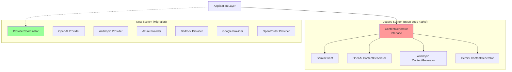

# Architecture Analysis: Current State Issues

## Executive Summary

After completing the migration from opencode and crush, the qwen-code codebase now contains **duplicate and conflicting architectural patterns**. This document analyzes the technical debt introduced by the "patching" approach and proposes a unified architecture.

---

## 1. Current Architecture Problems

### 1.1 Dual Provider Systems

The codebase now has **two parallel LLM provider implementations**:



| Aspect            | Legacy (`core/`)                             | New (`provider/`)                   |
| :---------------- | :------------------------------------------- | :---------------------------------- |
| **Location**      | `core/contentGenerator.ts`, `core/client.ts` | `provider/*.ts`                     |
| **SDK**           | `@google/genai`, custom converters           | Vercel AI SDK (`ai`)                |
| **Architecture**  | Factory-based, Gemini-centric                | Interface-based, provider-agnostic  |
| **Coordinator**   | None (single provider)                       | `ProviderCoordinator` with fallback |
| **Used by**       | `GeminiClient`, `Config`, services           | Not integrated into main flow       |
| **Lines of Code** | ~150KB                                       | ~60KB                               |

### 1.2 API Inconsistency

The legacy system uses **Google GenAI types** everywhere:

```typescript
// Legacy - core/client.ts
import type { Content, GenerateContentResponse } from '@google/genai';

class GeminiClient {
  generateContent(contents: Content[], ...): Promise<GenerateContentResponse>
}
```

The new system uses **Vercel AI SDK types**:

```typescript
// New - provider/types.ts
import type { LanguageModel, ModelMessage } from 'ai';

interface Provider {
  languageModel(modelId: string): LanguageModel;
  chat(messages: ChatMessage[], options?: ChatOptions): Promise<ChatResponse>;
}
```

### 1.3 Dead Code / Unused Features

The new provider system (ProviderCoordinator, Azure, Bedrock, Google Vertex, OpenRouter providers) is **fully implemented but not connected** to the application flow:

```typescript
// provider/coordinator.ts - UNUSED
export class ProviderCoordinator implements Coordinator {
  registerProvider(provider: Provider): void
  chat(messages, options): Promise<ChatResponse>  // Never called
  chatStream(...): AsyncGenerator<ChatChunk>      // Never called
}
```

### 1.4 Configuration Fragmentation

Two separate configuration systems exist:

| System | Config Type                           | Files                      |
| :----- | :------------------------------------ | :------------------------- |
| Legacy | `ContentGeneratorConfig`              | `core/contentGenerator.ts` |
| New    | `ProviderConfig`, `CoordinatorConfig` | `provider/types.ts`        |

### 1.5 Tool/Service Integration Issues

The migrated components are not properly integrated:

| Component            | Status         | Integration Issue                                  |
| :------------------- | :------------- | :------------------------------------------------- |
| LSP Server/Client    | ✅ Implemented | ✅ Integrated via `LSPManager`                     |
| Plugin System        | ✅ Implemented | ⚠️ Not hooked into main flow                       |
| Skills Manager       | ✅ Implemented | ⚠️ Partial integration                             |
| ACP Agent            | ✅ Implemented | ❌ Uses separate message types                     |
| Session Compaction   | ✅ Implemented | ⚠️ Not connected to `GeminiClient.tryCompressChat` |
| Provider Coordinator | ✅ Implemented | ❌ Completely unused                               |

---

## 2. Root Cause Analysis

The issues stem from:

1. **Direct Porting Without Refactoring**: Features were ported as-is without consolidating with existing systems
2. **Google GenAI Lock-in**: The original codebase was tightly coupled to `@google/genai` types
3. **Missing Abstraction Layer**: No unified interface for LLM providers existed before migration
4. **Incremental vs. Replacement**: Migration added new code alongside old code instead of replacing

---

## 3. Technical Debt Impact

### 3.1 Maintenance Cost

- **Dual Testing**: Two provider systems require separate test suites
- **Bug Duplication**: Fixes must be applied to both systems
- **Documentation Confusion**: Users see two ways to do the same thing

### 3.2 Performance Impact

- **Bundle Size**: ~150KB of redundant provider code
- **Initialization**: Two provider systems initialize separately
- **Memory**: Duplicate model registries, config stores

### 3.3 Feature Parity Issues

| Feature           | Legacy            | New           | Gap                           |
| :---------------- | :---------------- | :------------ | :---------------------------- |
| Provider Fallback | ❌                | ✅            | Legacy lacks resilience       |
| Health Checks     | ❌                | ✅            | Legacy can't detect failures  |
| Model Switching   | ❌                | ✅            | Legacy is static              |
| Azure/Bedrock     | ❌                | ✅            | Legacy limited to 3 providers |
| Token Counting    | ✅ (per-provider) | ✅ (tiktoken) | Inconsistent                  |

---

## 4. Recommended Solution

See [architecture_redesign.md](./architecture_redesign.md) for the unified architecture proposal.

See [migration_plan.md](./migration_plan.md) for the incremental execution plan.
